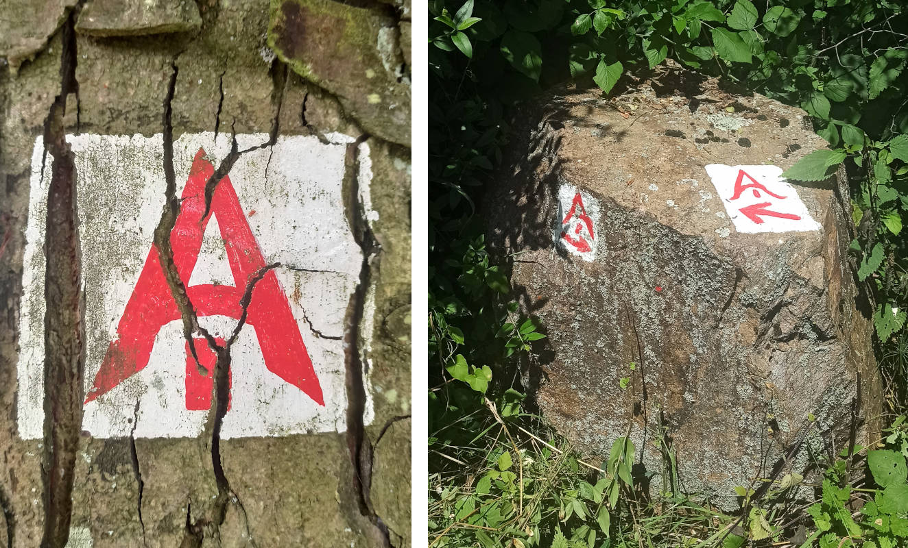

# Odenwald Schmetterling

Beim Odenwälder Schmetterling handelt es sich um ein Wanderwege-Konzept,
dass mittlerweile nach aktuellem Stand wohl aufgegeben wurde.

Die hier vorgestellten GPX-Daten entsprechen in etwa den früheren Wegeverläufen.
Es gibt derzeit keine einheitliche Wegeausschilderung und daher gilt um so mehr,
dass man die GPX-Daten logischerweise wie immer eigenverantwortlich nutzt.

Der insgesamt über 500km umfassende Schmetterling besteht
aus 4 Wanderwegen, die sozusagen dessen Flügel bilden:

* [Alemannenweg](Alemannenweg.gpx) im Nordwesten relativ zu Michelstadt / Erbach,
* [Frankenweg](Frankenweg.gpx) im Nordosten,
* [Badener Weg](Badener_Weg.gpx) im Südosten und
* [Burgundenweg](Burgundenweg.gpx) im Südwesten.

Michelstadt und Erbach liegen dabei relativ zentral im Odenwald und bilden mögliche
zentrale Startpunkte für alle Wege.

Diesen einzelnen Wanderwegen wurden jeweils Farben und im Namen auch Volksstämme zugeordnet.
Es gibt keine Belege, dass diese Volksstämme genau in der zugeordneten Region irgendwie aktiver
waren. Die Zuordnung geschah vermutlich eher willkürlich. Dennoch gibt es im gesamten Odenwald
sicherlich immer wieder Hinweise oder Indizien, dass Franken, Alemannen, Burgunden und Badener
regional ansäßig waren oder Kontakt bestand.

___Aufgepasst:___
_Beim Frankenweg des Odenwald-Schmetterlings mit etwa 97 km handelt es sich nicht um
den [Frankenweg](https://www.frankenweg.de/) vom Rennsteig zur Schwäbischen Alb mit seinen
knapp 520 km._

<table>
<thead><tr>
<th>Wegebezeichnung</th><th>Odenwaldregion</th><th>Farbe</th><th>Länge</th><th>Höhenmeter</th>
</tr></thead>
<tbody><tr>
<td>Alemannenweg</td><td>Nordwest</td><td>rot</td><td>137 km</td><td></td>
</tr>
<tr>
<td>Frankenweg</td><td>Nordost</td><td>blau</td><td>97 km</td><td></td>
</tr>
<tr>
<td>Badener Weg</td><td>Südost</td><td>gelb</td><td>161 km</td><td></td>
</tr>
<tr>
<td>Burgundenweg</td><td>Südwest</td><td>grün</td><td>154 km</td><td></td>
</tr></tbody>
</table>

Der Alemannenweg hat aktuell eine eigene durchgängige Wegemarkierung (rotes A mit kleinem senkrechten Strich darunter) und wird vom Odenwaldklub
als Hauptwanderweg 71 (HW71) betreut.  

Eine durchgängige Wegemarkierung entlang des Frankenwegs des Odenwald-Schmetterlings gibt es nicht.
Teilabschnitte anderer Wanderwege verlaufen zeitweise gemeinsam mit dem Frankenweg.
Insbesondere trifft man auf den

* Vier-Länder-Weg (HW18, gelbes Quadrat),
* Hessen-Kraichgau-Weg (HW25, rotes Dreieck),
* Bachgau-Kraichgau-Weg (HW27, rotes Andreaskreuz),
* Morre–Jagst-Weg (HW35, blaues Andreaskreuz),
* Fränkischer Rotweinwanderweg

Auf dem Badener Weg ist abschnittsweise der Wegeverlauf identisch mit

* 6-Täler-Weg (HW22, grüne Raute),
* Kreuzwertheim nach Buchen (HW41, roter Punkt),
* Bergstraße-Madonnenländchen-Weg (HW30, grünes Quadrat),
* Main-Neckar-Weg (HW33, blaue Raute),
* Bauland-Weg (HW43, blaues Dreieck),
* Heidelberg nach Möckmühl (HW40, grünes Kreuz),
* Rechter Neckarrandweg (HW64, rotes R),
* Linker Neckarrandweg (HW62, gelbes R),
* Hessen-Kraichgau-Weg (HW25, rotes Dreieck),
* Auf den Spuren der Römer (HW34, gelbes Andreaskreuz),
* Bachgau-Kraichgau-Weg (HW27, rotes Andreaskreuz)

Der Burgundenweg hat gemeinsame Wegeabschnitte mit

* Hessen-Kraichgau-Weg (HW25, rotes Dreieck),
* Von der Odenwälder Weininsel in den Kleinen Odenwald (HW23, blaues Kreuz),
* Kultur und Technik (HW19, blaues Quadrat),
* Linker Neckarrandweg (HW62, gelbes R),
* Main-Stromberg-Weg (HW15, rotes Quadrat),
* Franken-Hessen-Kurpfalz-Weg (HW21, rotes Kreuz),
* Odenwald-Vogesen-Weg (HW7, roter Balken),
* 6-Täler-Weg (HW22, grüne Raute)

Etwa 2005 wurden als Herausgeber und Informationsstellen des Wanderwege-Konzeptes verschiedene
Touristikverbände, Wanderklubs und Gebietsbetreuer genannt:

* TouristikService Odenwald-Bergstraße e.V.
* Touristik-Zentrum Odenwald
* Touristikgemeinsachft Odenwald e.V.
* Tourist-Information Spessart-Main-Odenwald
* Odenwaldklub e.V.
* Naturpark Neckartal-Odenwaald e.V.
* UNESCO Geopark Bergstraße-Odenwald

Als ich selbst nach aktuellen Informationen zum Odenwälder Schmetterling suchte, konnte mir
von diesen offiziellen Stellen nach Anfrage leider nicht weitergeholfen werden. Ich hoffe,
diese Informationssammlung und die Tourenvorschläge helfen Interessierten weiter.

Gruß und viel Spaß mit den gesammelten Informationen...

Wenn man nicht damit rechnet, findet man noch tief versteckt im Odenwald Hinweise, dass es
mal Wegebeschilderungen für den Odenwälder Schmetterling gab oder diese vielleicht geplant waren.
